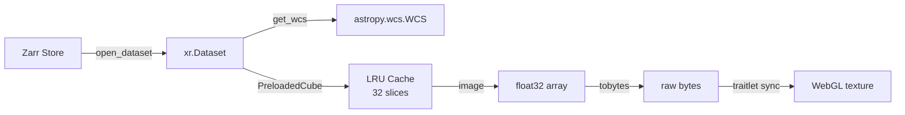

# Data Pipeline

The data pipeline reads zarr stores, extracts WCS metadata, and delivers image slices to the WebGL renderer as raw float32 bytes.

## Pipeline Stages



## open_dataset()

Unified entry point for loading zarr data. Accepts three source types:

| Source | Example | Mechanism |
|---|---|---|
| Local path | `"/path/to/data.zarr"` | `xr.open_zarr(path)` |
| Remote URL | `"s3://bucket/data.zarr"` | fsspec mapper + `xr.open_zarr(store)` |
| In-memory | `zarr.MemoryStore()` | Direct `xr.open_zarr(store)` |

```python
from astrowidget import open_dataset

# All three return xr.Dataset
ds = open_dataset("/local/path.zarr")
ds = open_dataset("s3://bucket/path.zarr", storage_options={...})
ds = open_dataset(zarr.MemoryStore())
```

### Chunking

| Option | Behavior |
|---|---|
| `chunks="auto"` (default) | Let xarray/dask optimize |
| `chunks={"l": 512, "m": 512}` | Explicit chunk sizes |
| `chunks=None` | Load entirely into memory |

## WCS Extraction

`get_wcs(ds, var="SKY")` searches for the FITS WCS header string in three locations (in order):

1. **Variable attrs**: `ds["SKY"].attrs["fits_wcs_header"]`
2. **Dataset attrs**: `ds.attrs["fits_wcs_header"]`
3. **0-D variable**: `ds["wcs_header_str"]` (bytes → string → Header)

This redundant storage pattern is inherited from ovro-lwa-portal's FITS→zarr conversion, which writes the WCS header to all three locations to survive xarray merge operations.

```python
from astrowidget import get_wcs

wcs = get_wcs(ds)  # returns astropy.wcs.WCS
print(wcs.wcs.ctype)   # ['RA---SIN', 'DEC--SIN']
print(wcs.wcs.crval)   # [180.0, 45.0]
```

## PreloadedCube

LRU-cached slice loader that provides fast access to 2D image slices for interactive exploration.

### How it works

1. **Strided downsampling**: Caps display resolution at `max_size` (default 512) pixels per axis
2. **LRU cache**: Stores the 32 most recently accessed slices in memory
3. **On-demand loading**: Each slice is loaded from zarr only on first access

```python
from astrowidget import PreloadedCube

cube = PreloadedCube(ds, var="SKY", pol=0, max_size=512)

# First access: reads from zarr (~64MB S3 chunk), strides down
img = cube.image(time_idx=0, freq_idx=0)  # shape: (512, 512)

# Second access: instant (cache hit)
img = cube.image(time_idx=0, freq_idx=0)  # same object returned

# Spectrum at a pixel across all frequencies
spec = cube.spectrum(l_idx=256, m_idx=256, time_idx=0)

# Light curve at a pixel across all times
lc = cube.light_curve(l_idx=256, m_idx=256, freq_idx=0)
```

### Performance

| Operation | Latency | Mechanism |
|---|---|---|
| First slice (S3) | ~3s | One 64MB chunk read + stride |
| First slice (local) | <100ms | Local disk read + stride |
| Cached slice | <1ms | LRU cache hit |
| Spectrum (all freqs) | ~1ms per freq | Cache hits for each slice |

## Binary Transfer

Image data is sent from Python to JavaScript as raw float32 bytes via anywidget's `Bytes` traitlet:

```python
# Python side (widget.py)
self.image_data = data.tobytes()      # ~1MB for 512x512 float32
self.image_shape = (512, 512)
self.crval = (180.0, 45.0)            # float64 precision preserved
self.cdelt = (-0.0003, 0.0003)
self.crpix = (256.5, 256.5)
```

```javascript
// JS side (inline_widget.js)
const bytes = model.get("image_data");  // DataView
const float32 = new Float32Array(bytes.buffer.slice(...));
const uint8 = normalizeToUint8(float32, vmin, vmax);
gl.texImage2D(..., uint8);  // upload to GPU
```

!!! note "Why uint8 instead of float32 textures?"
    Float textures (`GL_R32F`) don't work reliably when anywidget loads the ESM
    via blob URLs. The `luminance` + `float` format produced black canvases in
    WebGL2. uint8 RGBA textures are universally supported and the normalization
    cost is negligible (~1ms for 512x512).
