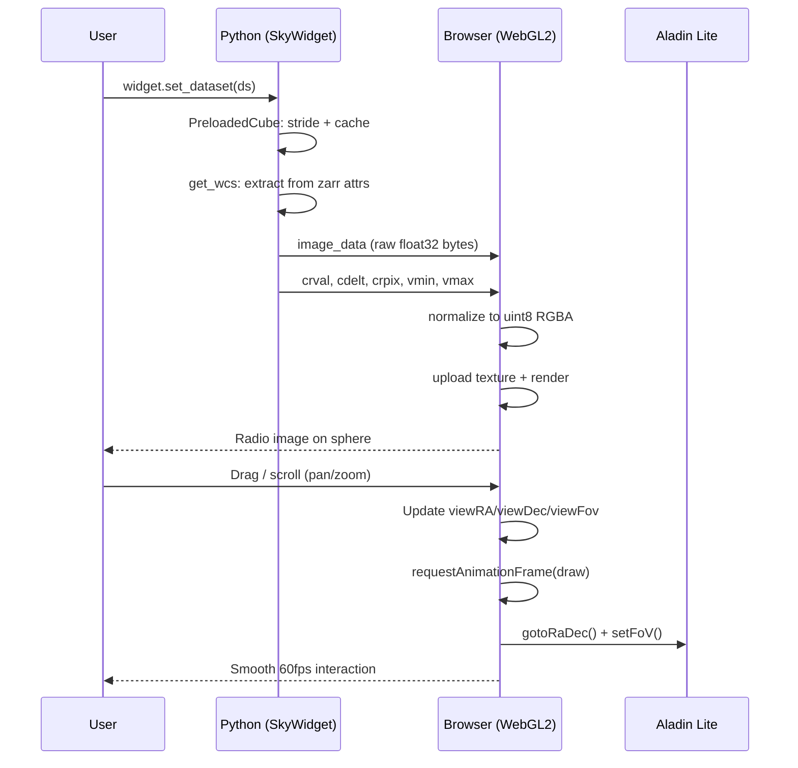

# Architecture Overview

astrowidget is an anywidget-based Jupyter widget that renders radio astronomy images on a rotatable celestial sphere using WebGL2.

## System Design

```mermaid
graph TD
    subgraph Python
        Z[Zarr Store] -->|xarray| OD[open_dataset]
        OD --> DS[xr.Dataset]
        DS --> PC[PreloadedCube<br/>LRU cache, strided downsampling]
        DS --> WCS[get_wcs<br/>WCS from zarr metadata]
        PC -->|float32 slice| SW[SkyWidget<br/>anywidget.AnyWidget]
        WCS -->|CRVAL, CDELT, CRPIX| SW
        SW -->|Bytes traitlet| COMM[anywidget comm]
    end

    subgraph Browser
        COMM -->|binary float32| JS[inline_widget.js]
        JS -->|uint8 RGBA| TEX[WebGL2 Texture]
        TEX --> SHADER[Fragment Shader<br/>SIN projection]
        SHADER --> CANVAS[Canvas]
        JS -->|view sync| AL[Aladin Lite<br/>HiPS background]
        AL --> BG[Background div]
    end

    style Z fill:#2d5016
    style SHADER fill:#1a3a5c
    style AL fill:#5c1a3a
```



## Key Components

| Component | File | Purpose |
|---|---|---|
| `SkyWidget` | `src/astrowidget/widget.py` | anywidget Python class, traitlets, `set_image()`, `goto()` |
| `open_dataset` | `src/astrowidget/io.py` | Unified zarr loading (local, S3, in-memory) |
| `get_wcs` | `src/astrowidget/wcs.py` | Extract WCS from zarr metadata (3 fallback locations) |
| `PreloadedCube` | `src/astrowidget/cube.py` | LRU-cached slice loader with strided downsampling |
| `SkyViewer` | `src/astrowidget/viewer.py` | Panel dashboard with controls and linked HoloViews |
| `inline_widget.js` | `js/inline_widget.js` | WebGL2 renderer, SIN projection shader, interaction |

## Data Flow



## Package Structure

```
astrowidget/
├── src/astrowidget/
│   ├── __init__.py        # Public API exports
│   ├── widget.py          # SkyWidget (anywidget)
│   ├── io.py              # open_dataset()
│   ├── wcs.py             # get_wcs()
│   ├── cube.py            # PreloadedCube
│   ├── viewer.py          # SkyViewer (Panel)
│   └── static/
│       └── widget.js      # Bundled JS (copy of inline_widget.js)
├── js/
│   ├── inline_widget.js   # WebGL2 renderer (source of truth)
│   ├── projection.js      # SIN projection math (for tests)
│   ├── colormap.js        # Colormap generation
│   ├── interaction.js     # Pan/zoom handlers (legacy, unused)
│   ├── renderer.js        # regl renderer (legacy, unused)
│   └── widget.js          # Vite entry point (legacy, unused)
├── tests/
│   ├── test_widget.py     # 15 tests: widget, set_image, goto
│   ├── test_io.py         # 9 tests: open_dataset, in-memory
│   ├── test_cube.py       # 11 tests: PreloadedCube, caching
│   ├── test_controls.py   # 13 tests: grid, sliders, auto-scale
│   ├── test_viewer.py     # 8 tests: SkyViewer, from_zarr
│   ├── test_background.py # 7 tests: background traitlets
│   ├── js/projection.test.js  # 15 tests: SIN projection roundtrip
│   └── fixtures/
│       └── projection_vectors.json  # Astropy-generated test vectors
├── pyproject.toml         # Package config + pixi workspace
├── mkdocs.yml             # Documentation config
└── .github/workflows/
    └── publish.yml        # PyPI trusted publisher
```

## Technology Choices

| Decision | Choice | Rationale |
|---|---|---|
| Widget framework | anywidget | Works in JupyterLab, VSCode, Marimo. No comm conflicts with Panel. |
| Renderer | Raw WebGL2 | regl bundle didn't render in JupyterLab. Raw GL works reliably. |
| Projection | Fragment shader SIN | Per-pixel accuracy. No tessellation needed. 60fps on any GPU. |
| Data transfer | Binary float32 bytes | ~1MB for 512x512. 10x faster than FITS serialization. |
| Environment | Pixi | Reproducible, conda-forge packages, single lockfile. |
| HiPS background | Aladin Lite via esm.sh | JS-side view sync (no Python round-trip). Uses ipyaladin's proven import pattern. |
| Texture format | uint8 RGBA | Float textures don't work in WebGL2 via anywidget's blob URL context. |
