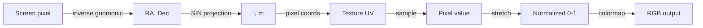

# WebGL Renderer

The renderer uses a single WebGL2 fragment shader to project radio images onto the celestial sphere at 60fps.

## Rendering Pipeline

For each screen pixel, the fragment shader computes:



1. **Screen → celestial**: Inverse gnomonic projection from the current view center
2. **Celestial → direction cosines**: SIN (orthographic) projection from the image's phase center
3. **Direction cosines → pixel**: Linear mapping via CDELT and CRPIX
4. **Sample → stretch → colormap**: Normalize, apply stretch function, look up colormap

## SIN Projection Math

The SIN projection (Calabretta & Greisen 2002) maps celestial coordinates to direction cosines:

### Forward: (RA, Dec) → (l, m)

```
l = cos(Dec) * sin(RA - RA0)
m = sin(Dec) * cos(Dec0) - cos(Dec) * sin(Dec0) * cos(RA - RA0)
```

### Visibility check

```
cos(c) = sin(Dec)*sin(Dec0) + cos(Dec)*cos(Dec0)*cos(RA - RA0)
visible = cos(c) > 0
```

### Pixel coordinates

```
px = l / CDELT1 + CRPIX1
py = m / CDELT2 + CRPIX2
```

!!! warning "Coordinate Alignment"
    The JS projection math must match astropy's WCS to sub-arcsecond precision.
    Test vectors in `tests/fixtures/projection_vectors.json` (generated by
    `tests/generate_test_vectors.py`) validate both Python and JS implementations.

## Stretch Functions

| Name | Formula | Use case |
|---|---|---|
| `linear` | `norm` | Default, uniform mapping |
| `log` | `log(norm * 99 + 1) / log(100)` | High dynamic range |
| `sqrt` | `sqrt(norm)` | Moderate compression |
| `asinh` | `asinh(norm * 10) / asinh(10)` | Faint source enhancement |

## Colormaps

Generated as 256-entry uint8 RGBA textures. Available presets:

`inferno` (default), `viridis`, `plasma`, `magma`, `grayscale`

## Coordinate Grid

The RA/Dec grid is rendered in the fragment shader by checking proximity to RA/Dec multiples:

```glsl
float interval = gridInterval(fovDeg);  // auto-scales: 30° → 0.1°
float raRem = mod(raDeg, interval);
if (raRem < lineWidth) gridAlpha = 0.35;
```

Grid intervals auto-scale with FOV:

| FOV | Grid interval |
|---|---|
| > 90° | 30° |
| 30° - 90° | 10° |
| 10° - 30° | 5° |
| 3° - 10° | 1° |
| 1° - 3° | 0.5° |
| < 1° | 0.1° |

## Toolbar

Three interaction modes accessible via toolbar buttons:

| Button | Mode | Behavior |
|---|---|---|
| ↻ | Reset | Returns to initial view (phase center + fitted FOV) |
| ✥ | Pan | Default. Drag to rotate the sphere. |
| ⬚ | Box Zoom | Drag a rectangle to zoom into that region. |

## Aladin Lite Integration

When `background_survey` is set, Aladin Lite is loaded via dynamic `import()` from `esm.sh` and rendered in a div behind the transparent WebGL canvas. View sync happens on every interaction frame in JS:

```javascript
function syncAladin() {
    if (!aladin) return;
    aladin.gotoRaDec(raDeg, decDeg);
    aladin.setFoV(fovDeg);
}
// Called on every mousemove (during drag) and wheel event
```

!!! tip "Why JS-side sync?"
    Python round-trip (JS → Python → JS) adds ~50-100ms latency, causing
    visible drift between the radio overlay and the background. JS-side sync
    via `aladin.gotoRaDec()` is instantaneous.
