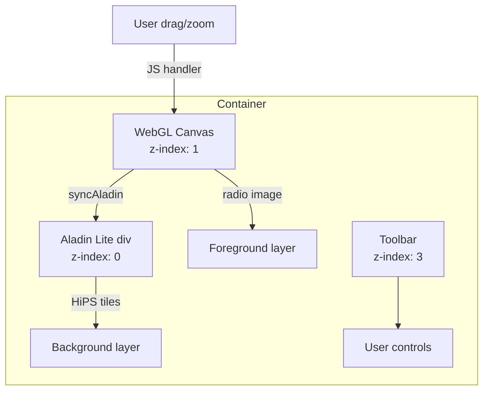

# HiPS Backgrounds

Overlay radio data on astronomical survey tiles using Aladin Lite embedded behind the WebGL canvas.

## Quick Start

Set `background_survey` **before** displaying the widget:

```python
from astrowidget import SkyWidget

widget = SkyWidget()
widget.set_dataset(ds)
widget.background_survey = "DSS"
widget
```

## Available Surveys

| Preset | HiPS URL | Description |
|---|---|---|
| `DSS` | `CDS/P/DSS2/color` | Digitized Sky Survey (optical) |
| `2MASS` | `CDS/P/2MASS/color` | 2MASS near-infrared |
| `WISE` | `CDS/P/allWISE/color` | AllWISE mid-infrared |
| `Planck` | `CDS/P/PLANCK/R2/HFI/color` | Planck HFI microwave |
| `SDSS` | `CDS/P/SDSS9/color` | Sloan Digital Sky Survey |
| `Mellinger` | `CDS/P/Mellinger/color` | Mellinger optical panorama |
| `Fermi` | `CDS/P/Fermi/color` | Fermi gamma-ray |
| `Haslam408` | `CDS/P/HI4PI/NHI` | Haslam 408 MHz radio |

You can also pass any HiPS URL directly:

```python
widget.background_survey = "CDS/P/DSS2/blue"
```

## How It Works



1. Aladin Lite is loaded via `import("https://esm.sh/aladin-lite@3.7.3-beta")` inside the widget's `render()` function
2. The Aladin div is positioned behind the WebGL canvas (z-index 0 vs 1)
3. The WebGL canvas clears to transparent (`gl.clearColor(0,0,0,0)`) so the background shows through
4. On every pan/zoom interaction, `syncAladin()` calls `aladin.gotoRaDec()` and `aladin.setFoV()` directly in JavaScript — zero Python round-trip

## Switching Surveys

```python
widget.background_survey = "WISE"      # switch to WISE
widget.background_survey = "Planck"    # switch to Planck
widget.background_survey = ""          # disable background
```

!!! note "Survey switching requires the widget to be re-displayed"
    If the background survey is changed after the widget is already displayed,
    the survey switches on the existing Aladin instance. If changing from no
    background to a background, the widget needs to be re-displayed because
    Aladin Lite is initialized during `render()`.

## Alignment Verification

Navigate to a known bright radio source and verify the radio emission aligns with the optical position:

```python
from astropy.coordinates import SkyCoord
import astropy.units as u

# Cas A — brightest radio source in northern sky
widget.goto(SkyCoord.from_name("Cas A"), fov=30 * u.deg)
```

The radio emission should overlap the optical supernova remnant in the DSS background.
